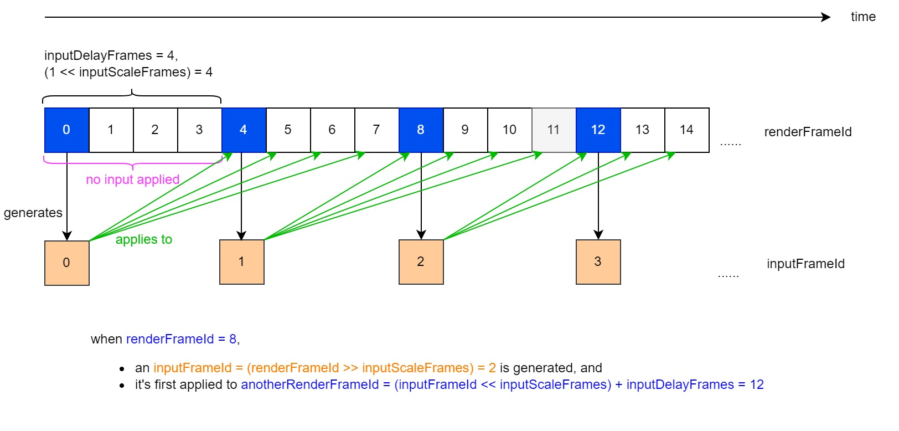
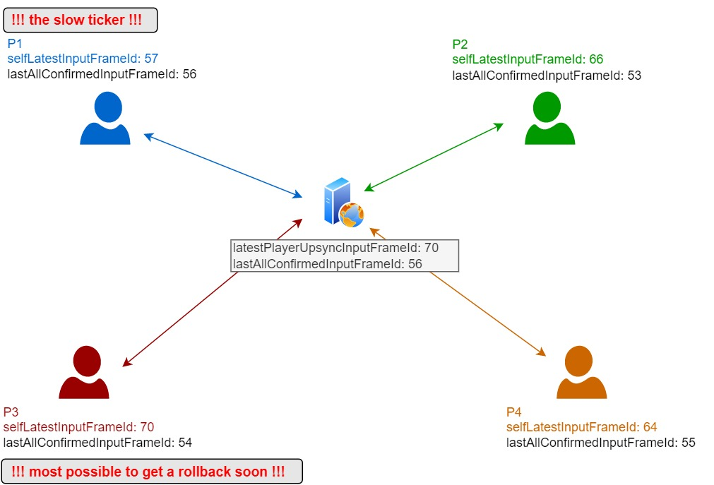

# What's this project?
It's a Unity version of [DelayNoMore](https://github.com/genxium/DelayNoMore), a Multiplayer Platformer game demo on websocket with delayed-input Rollback Netcode inspired by GGPO -- but with the backend also rebuilt in C#.

(battle between celluar 4G Android v.s. Wifi Android via internet (but UDP peer-to-peer holepunch failed), input delay = 2 frames i.e. ~32ms, [original video here](https://pan.baidu.com/s/1tJg_9QNYLz4TQTt3C-snRw?pwd=0e16))


# Notable Features (by far, would add more in the future)
- Automatically correction for "slow ticker", especially "active slow ticker" which is well-known to be a headache for input synchronization
- Peer-to-peer UDP holepunching whenever possible, and will fallback to use the backend as a UDP relay/tunnel if holepunching failed for any participant (kindly note that UDP is always used along side with WebSocket, where the latter is a golden source of frame info)
- Frame logging toggle for both frontend & backend (i.e. `backend/Battle/Room.frameLogEnabled`), useful for debugging out of sync entities when developing new features
- Rollback compatible NPC patrolling and vision reaction

# How does it work to synchronize across multiple players?
_(how input delay roughly works)_



_(how rollback-and-chase in this project roughly works)_




_(though using C# for both backend & frontend now, the idea to avoid floating err remains the same as shown below)_


# 1. Building & running

## 1.1 Tools to install 
### Backend
- [.NET Framework 7.0](https://dotnet.microsoft.com/en-us/download/dotnet/7.0)
```bash
proj-root/backend> dotnet run
```

### Frontend
- [Unity 2021.3](https://unity.com/releases/editor/qa/lts-releases)

Open `OfflineScene` to try out basic operations.

Open `LoginScene` after launching the backend to try out multiplayer mode. Available test accounts are listed in [DevEnvResources.sqlite](./backend/DevEnvResources.sqlite). The steps are very similar to [that of DelayNoMore CocosCreator version](https://github.com/genxium/DelayNoMore#frontend-2).

### Unit test
Referencing [this document from Microsoft](https://learn.microsoft.com/en-us/dotnet/core/testing/unit-testing-with-dotnet-test) by far.

# FAQ
Please refer to [FAQ.md](FAQ.md).
